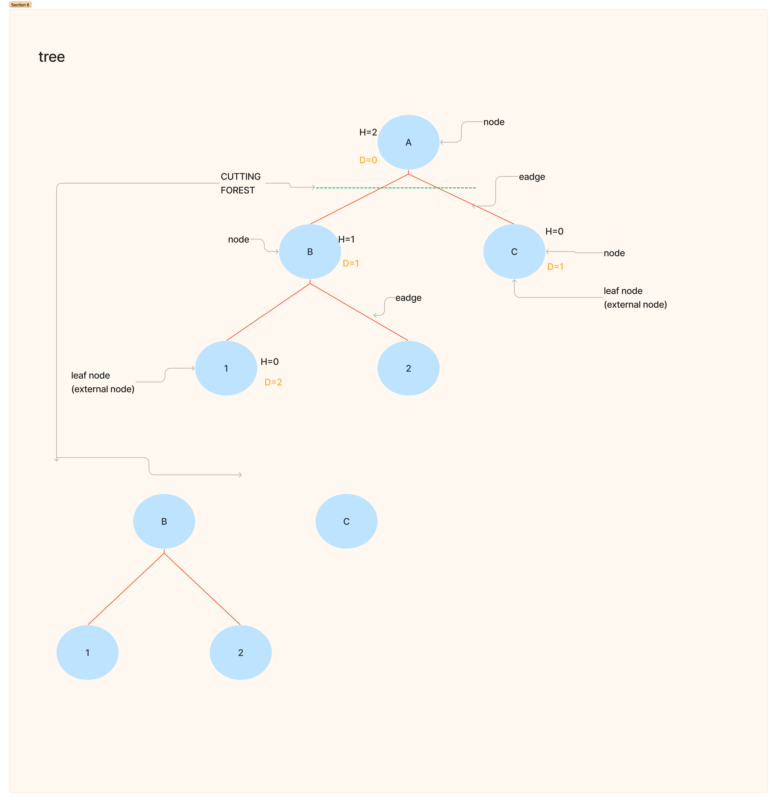

# tree

A tree is a nonlinear hierarchical data structure that consists of nodes connected by edges.

## Why Tree Data Structure?
Other data structures such as arrays, linked list, stack, and queue are linear data structures that store data sequentially. In order to perform any operation in a linear data structure, the time complexity increases with the increase in the data size. But, it is not acceptable in today's computational world.

Different tree data structures allow quicker and easier access to the data as it is a non-linear data structure.

## Tree Terminologies

### Node
A node is an entity that contains a key or value and pointers to its child nodes.

The last nodes of each path are called leaf nodes or external nodes that do not contain a link/pointer to child nodes.

The node having at least a child node is called an internal node.

### Edge
It is the link between any two nodes.

### Root
It is the topmost node of a tree.

### Height of a Node
The height of a node is the number of edges from the node to the deepest leaf (ie. the longest path from the node to a leaf node).

### Depth of a Node
The depth of a node is the number of edges from the root to the node.

### Height of a Tree
The height of a Tree is the height of the root node or the depth of the deepest node.

### Degree of a Node
The degree of a node is the total number of branches of that node.

### Forest
A collection of disjoint trees is called a forest.

You can create a forest by cutting the root of a tree.



## Tree Traversal
In order to perform any operation on a tree, you need to reach to the specific node. The tree traversal algorithm helps in visiting a required node in the tree.

## tree travirsal  what is it mean

Traversing a tree means visiting every node in the tree. You might, for instance, want to add all the values in the tree or find the largest one. For all these operations, you will need to visit each node of the tree.

Linear data structures like arrays, stacks, queues, and linked list have only one way to read the data. But a hierarchical data structure like a tree can be traversed in different ways.

### Inorder traversal
1. First, visit all the nodes in the left subtree
2. Then the root node
3. Visit all the nodes in the right subtree

```
inorder(root->left)
display(root->data)
inorder(root->right)
```

### Preorder traversal
1. Visit root node
2. Visit all the nodes in the left subtree
3. Visit all the nodes in the right subtree

```
display(root->data)
preorder(root->left)
preorder(root->right)
```

### Postorder traversal
1. Visit all the nodes in the left subtree
2. Visit all the nodes in the right subtree
3. Visit the root node

```
postorder(root->left)
postorder(root->right)
display(root->data)
```

## Types of Tree

- Binary Tree
- Binary Search Tree
- AVL Tree
- B-Tree


### Binary Tree

A binary tree is a tree data structure in which each parent node can have at most two children. Each node of a binary tree consists of three items:

- data item
- address of left child
- address of right child

#### Types of Binary Tree
- Full Binary Tree
> A full Binary tree is a special type of binary tree in which every parent node/internal node has either two or no children
- Perfect Binary Tree
> A perfect binary tree is a type of binary tree in which every internal node has exactly two child nodes and all the leaf nodes are at the same level.
- Complete Binary Tree
> A complete binary tree is just like a full binary tree, but with two major differences
> - Every level must be completely filled
  - All the leaf elements must lean towards the left.
  - The last leaf element might not have a right sibling i.e. a complete binary tree doesn't have to be a full binary tree. 
- Degenerate or Pathological Tree
> A degenerate or pathological tree is the tree having a single child either left or right.
- Skewed Binary Tree
> A skewed binary tree is a pathological/degenerate tree in which the tree is either dominated by the left nodes or the right nodes. Thus, there are two types of skewed binary tree: left-skewed binary tree and right-skewed binary tree.

- Balanced Binary Tree
> It is a type of binary tree in which the difference between the height of the left and the right subtree for each node is either 0 or 1.### Binary Tree

A binary tree is a tree data structure in which each parent node can have at most two children. Each node of a binary tree consists of three items:

- data item
- address of left child
- address of right child

#### Types of Binary Tree
- Full Binary Tree
> A full Binary tree is a special type of binary tree in which every parent node/internal node has either two or no children
- Perfect Binary Tree
> A perfect binary tree is a type of binary tree in which every internal node has exactly two child nodes and all the leaf nodes are at the same level.
- Complete Binary Tree
> A complete binary tree is just like a full binary tree, but with two major differences
> - Every level must be completely filled
  - All the leaf elements must lean towards the left.
  - The last leaf element might not have a right sibling i.e. a complete binary tree doesn't have to be a full binary tree. 
- Degenerate or Pathological Tree
> A degenerate or pathological tree is the tree having a single child either left or right.
- Skewed Binary Tree
> A skewed binary tree is a pathological/degenerate tree in which the tree is either dominated by the left nodes or the right nodes. Thus, there are two types of skewed binary tree: left-skewed binary tree and right-skewed binary tree.

- Balanced Binary Tree
> It is a type of binary tree in which the difference between the height of the left and the right subtree for each node is either 0 or 1.


### Binary Tree Representation

A node of a binary tree is represented by a structure containing a data part and two pointers to other structures of the same type.

`struct node
{
 int data;
 struct node *left;
 struct node *right;
}`


### Binary Tree Applications
- For easy and quick access to data
- In router algorithms
- To implement heap data structure
- Syntax tree

## Binary Search Tree(BST)

Binary search tree is a data structure that quickly allows us to maintain a sorted list of numbers.

- It is called a binary tree because each tree node has a maximum of two children.
- It is called a search tree because it can be used to search for the presence of a number in O(log(n)) time.

The properties that separate a binary search tree from a regular binary tree is

- All nodes of left subtree are less than the root node
- All nodes of right subtree are more than the root node
- Both subtrees of each node are also BSTs i.e. they have the above two properties

### Search Operation
The algorithm depends on the property of BST that if each left subtree has values below root and each right subtree has values above the root.

If the value is below the root, we can say for sure that the value is not in the right subtree; we need to only search in the left subtree and if the value is above the root, we can say for sure that the value is not in the left subtree; we need to only search in the right subtree.

### Insert Operation
Inserting a value in the correct position is similar to searching because we try to maintain the rule that the left subtree is lesser than root and the right subtree is larger than root.

We keep going to either right subtree or left subtree depending on the value and when we reach a point left or right subtree is null, we put the new node there.

### Binary Search Tree Applications
- In multilevel indexing in the database
- For dynamic sorting
- For managing virtual memory areas in Unix kernel


## Tree Applications
- Binary Search Trees(BSTs) are used to quickly check whether an element is present in a set or not.
- Heap is a kind of tree that is used for heap sort.
- A modified version of a tree called Tries is used in modern routers to store routing information.
- Most popular databases use B-Trees and T-Trees, which are variants of the tree structure we learned above to store their data
- Compilers use a syntax tree to validate the syntax of every program you write.