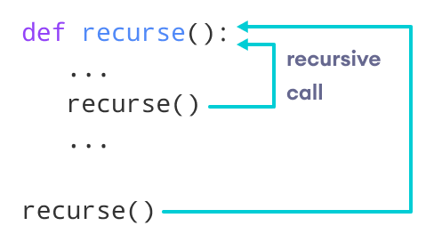

# python classes and object

## Discussion Questions

### differences between classes and objects in Python

There are many differences between object and class. Some differences between object and class are given below:
A class is considered as a blueprint of objects. We can think of the class as a sketch (prototype) of a house. It contains all the details about the floors, doors, windows, etc. Based on these descriptions we build the house. House is the object.

An object is called an instance of a class. For example, suppose Bike is a class then we can create objects like bike1, bike2, etc from the class.

### concept of recursion and provide an example of how it can be used to solve a problem in Python

In Python, we know that a function can call other functions. It is even possible for the function to call itself. These types of construct are termed as recursive functions.

The following image shows the working of a recursive function called recurse.

Following is an example of a recursive function to find the factorial of an integer.

def factorial(x):
    """This is a recursive function
    to find the factorial of an integer"""

    if x == 1:
        return 1
    else:
        return (x * factorial(x-1))

### the purpose of pytest fixtures and code coverage in testing Python code? 

In testing, a fixture provides a defined, reliable and consistent context for the tests. This could include environment (for example a database configured with known parameters) or content (such as a dataset).

Fixtures define the steps and data that constitute the arrange phase of a test (see Anatomy of a test). In pytest, they are functions you define that serve this purpose. They can also be used to define a test’s act phase; this is a powerful technique for designing more complex tests.

The services, state, or other operating environments set up by fixtures are accessed by test functions through arguments. For each fixture used by a test function there is typically a parameter (named after the fixture) in the test function’s definition.

We can tell pytest that a particular function is a fixture by decorating it with @pytest.fixture. Here’s a simple example of what a fixture in pytest might look like:

@pytest.fixture
def append_first(order):
    order.append(1)