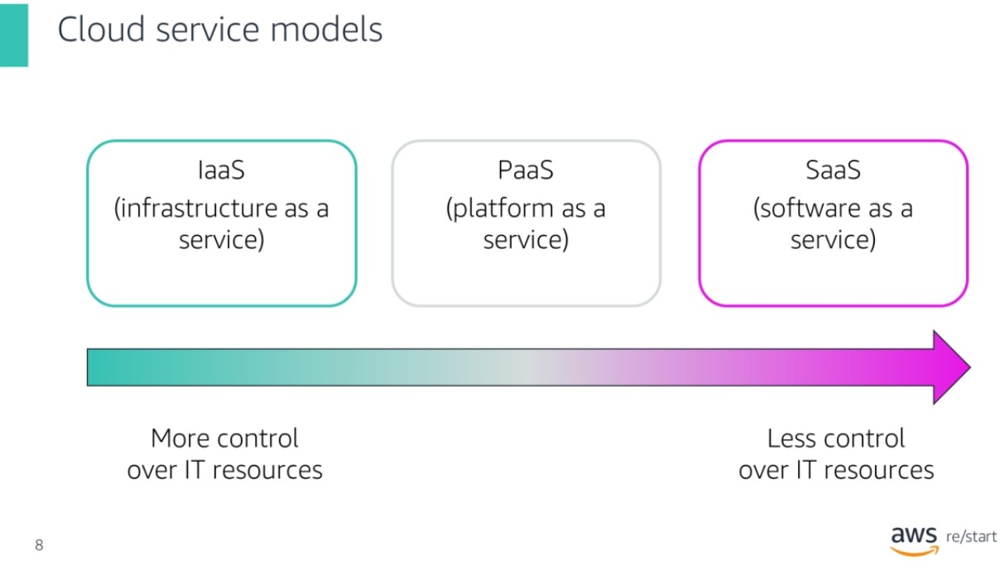
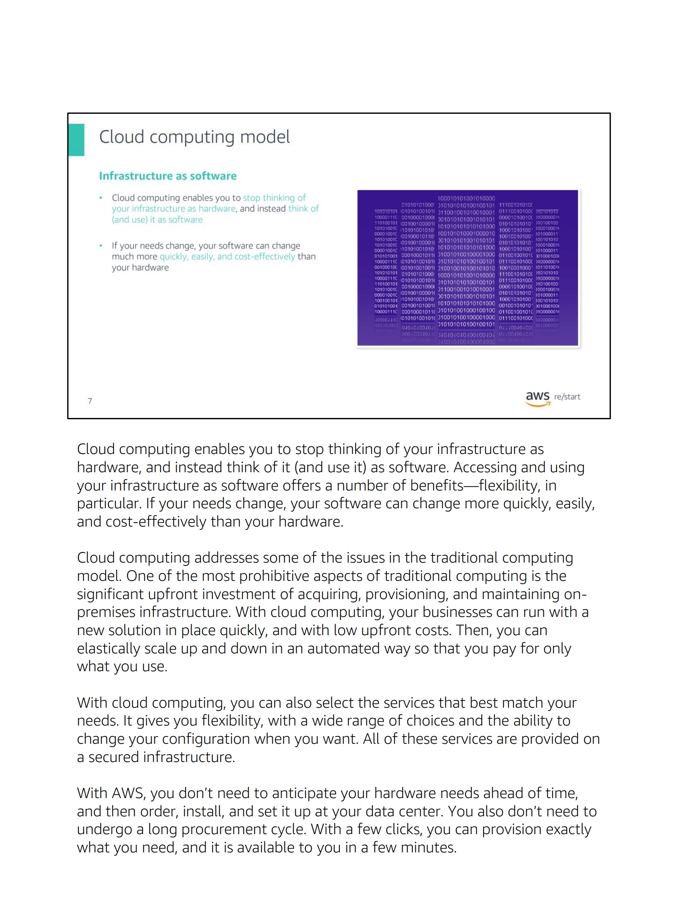
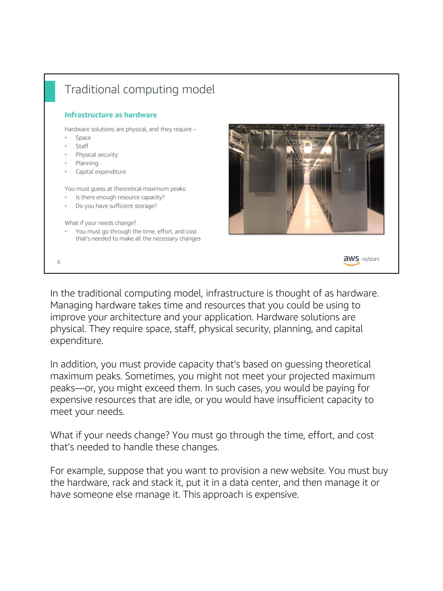

# serverles 

is a cloud computing servises model 
so what is cloud computing model



Cloud services fall into one of three primary categories, which are based mainly around how much control and responsibility you have over how the service is configured.
With infrastructure as a service (IaaS), you manage the server, which can be physical or virtual, and the operating system (Microsoft Windows or Linux). In general, the data center provider has no access to your server.
With platform as a service (PaaS), someone else manages the underlying hardware and operating systems. In this way, you can run applications without managing underlying infrastructure (for example, patching, updates, maintenance, hardware, and operating systems). PaaS also provides a framework for developers that they can build on to create customized applications.
With software as a service (SaaS), you manage your files while the service provider manages all data centers, servers, networks, storage, maintenance, and patching. You handle only the software and how you want to use it. You are provided with a complete product that the service provider runs and manages. Facebook and Dropbox are examples of SaaS. You manage your Facebook contacts and Dropbox files, and the service providers manage the systems.


## key characteristics of serverless computing ,and how does it differ from traditional server-based architectures?

1. No Server Management: In a traditional server-based architecture, you have to provision, configure, and manage servers to run your applications. In serverless computing, the cloud provider abstracts away the underlying infrastructure, so you don't need to worry about server management. You can focus solely on writing and deploying code

2. Event-driven: Serverless computing is highly event-driven. It allows you to define functions that are triggered by events, such as HTTP requests, database updates, file uploads, or time-based schedules. These functions are executed in response to events, and you are only charged for the actual execution time.

3. Auto Scaling: Serverless platforms automatically scale your applications based on the incoming workload. As the number of requests or events increases, the platform provisions additional resources to handle the load. Conversely, it scales down resources when there is little or no activity. This automatic scaling ensures that your application can handle variable workloads without manual intervention.

4. Stateless Functions: Serverless functions are stateless, meaning they don't maintain any persistent connection or state between invocations. Each function invocation is independent and isolated

5. Overall, serverless computing shifts the responsibility of infrastructure management to the cloud provider, offering increased scalability, cost efficiency, rapid development, and reduced operational complexity compared to traditional server-based architectures. It allows developers to focus on writing code and building applications without worrying about server provisioning, scaling, and maintenance.


## How can one get started with Vercel, and what are the main steps involved in deploying a serverless function using Vercel?

1. Sign up for a Vercel account: Visit the Vercel website (vercel.com) and sign up for an account. You can use your GitHub account to sign in.

2. Install Vercel CLI (Command-Line Interface): Vercel provides a CLI tool that you can install on your local machine. The CLI allows you to deploy projects and manage deployments from your terminal.

3. Set up your project

4. Write your serverless function: In your project directory, create a new directory for your serverless function. Inside this directory,

5. Deploy your function: Use the Vercel CLI to deploy your function. Run the vercel command in your project directory,

6. Monitor and manage deployments: Vercel provides a dashboard where you can monitor and manage your deployments.


## What are APIs, and how can they be utilized in Python applications to access and manipulate data from external sources?

APIs, or Application Programming Interfaces, allow software applications to communicate with each other. In Python, APIs can be used to access and manipulate data from external sources by making HTTP requests to API endpoints, handling the responses, and processing the data as needed. Python libraries like Requests or aiohttp simplify the process of making API requests and handling responses, while the API documentation provides details on the available endpoints, request parameters, authentication methods, and response formats.

## What is the Requests library in Python

The Requests library is a popular third-party library in Python that simplifies making HTTP requests. It provides a simple and elegant API for sending HTTP/1.1 requests and handling responses.

With the Requests library, you can perform common HTTP operations, such as sending GET, POST, PUT, DELETE requests, and more. It supports various features like adding headers, setting cookies, handling redirects, and handling authentication.

Here's a simple example of using the Requests library to make a GET request:

```
import requests

response = requests.get('https://api.example.com/data')
if response.status_code == 200:
    data = response.json()
    # Process the data as needed
else:
    print('Request failed with status code:', response.status_code)
```

To use the Requests library in your Python project, you can install it using pip:

` pip install requests`


## Things I want to know more about

### what is cloud computing 
Cloud computing is the on-demand delivery of compute power, database, storage, applications, and other IT resources. These resources are delivered through a cloud services platform via the internet, with pay-as-you-go pricing

The computers contain various technology features and services, which are like building blocks that can be used to assemble solutions. These solutions help users meet their business goals and technology requirements. With cloud computing, organizations can consume on-demand computing and storage resources instead of building, operating, and improving infrastructure on their own.



### what is traditional computing method :
to understand traditional see this image  


### resorces 
aws cloud computing 