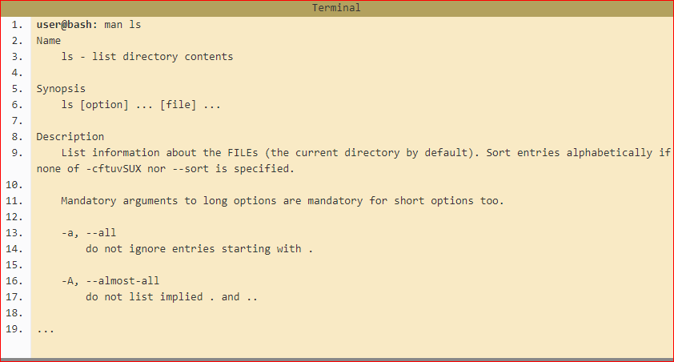

#  Bash Command Line 

 Working through this beginners guide to the Linux command line (BASH) you will be up and running utilising powerful techniques, tips and tricks to make your life easier in no time. The following pages are intended to give you a solid foundation in how to use the terminal, to get the computer to do useful work for you. You won't be a Unix guru at the end but you will be well on your way and armed with the right knowledge and skills to get you there if that's what you want (which you should because that will make you even more awesome).

## The Command Line - What is it, how does it work and how do I get to one.
A command line, or terminal, is a text based interface to the system. You are able to enter commands by typing them on the keyboard and feedback will be given to you similarly as text.

The command line typically presents you with a prompt. As you type, it will be displayed after the prompt. Most of the time you will be issuing commands. Here is an example:

## Basic Navigation

n this section, we'll learn the basics of moving around the system. Many tasks rely on being able to get to, or reference the correct location in the system. As such, this stuff really forms the foundation of being able to work effectively in Linux. Make sure you understand it well.

So where are we? 
`$: pwd` 

this comand tell us our location dairectory 

result :
`/home/ryan`

`$: ls`
this comand to see what we have in this directory , its shortcut for list

## More About Files!
everything is actually a file. A text file is a file, a directory is a file, your keyboard is a file (one that the system reads from only), your monitor is a file (one that the system writes to only) etc. To begin with, this won't affect what we do too much but keep it in mind as it helps with understanding the behaviour of Linux as we manage files and directories.

### type of file in linux 
-file.exe - an executable file, or program.
-file.txt - a plain text file.
-file.png, file.gif, file.jpg - an image.

### some codes to work with file 
`mkdir` create a directory 
`touch` create a new file 
` cd ` to moves between files 
`rm <file name>` remove file  or use `rm -rf <dir name>` to remove directory
`mv` to move the file and `cp` to copy a file

## Manual Pages!

The manual pages are a set of pages that explain every command available on your system including what they do, the specifics of how you run them and what command line arguments they accept. Some of them are a little hard to get your head around but they are fairly consistent in their structure so once you get the hang of it it's not too bad. You invoke the manual pages with the following command:

## File Manipulation!
Linux organises it's file system in a hierarchical way. Over time you'll tend to build up a fair amount of data (storage capacities are always increasing). It's important that we create a directory structure that will help us organise that data in a manageable way. I've seen way too many people just dump everything directly at the base of their home directory and waste a lot of their time trying to find what they are after amongst 100's (or even 1000's) of other files. Develop the habit of organising your stuff into an elegant file structure now and you will thank yourself for years to come.

## Cheat Sheet
[Cheat Sheet](https://ryanstutorials.net/linuxtutorial/cheatsheet.php)
